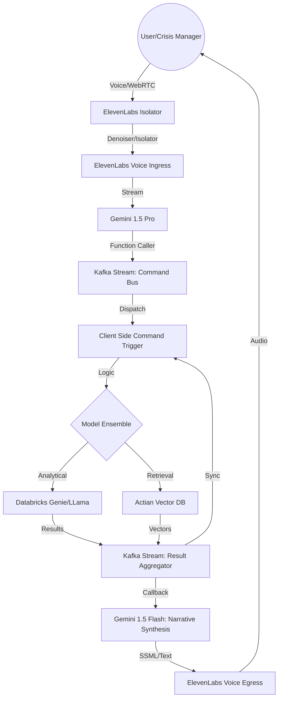

# 🌐 Crisis Topography: Command Center

[](https://hacklytics.io)
[](https://www.actian.com/)
[](https://www.databricks.com/)

> **Reframing Global Humanitarian Aid as a Quantitative Capital Allocation Challenge.**

Humanitarian aid allocation is currently reactive, driven by media sentiment rather than systemic need. **Crisis Topography** is a 3D spatial intelligence system designed to identify, analyze, and predict humanitarian crises through a visceral, agentic interface. 

## 🤖 The Magnum Opus: Meet Pablo

**Pablo is not just an AI; he is the sovereign orchestrator of the Crisis Topography Command Center.**

Commanded solely through natural language voice interaction, Pablo serves as the bridge between human intuition and machine intelligence. He doesn't just answer questions—he **drives** the entire system.

*   **Vocal Autonomy**: Utilizing the **ElevenLabs Voice Isolator** and high-fidelity WebRTC streams, Pablo hears through the noise of any crisis environment.
*   **Intuitive Navigation**: Tell Pablo, *"Take me to the border of Sudan,"* and he will physically fly the 3D globe to the precise location, adjusting altitudes and atmospheric glow to highlight semantic anomalies.
*   **Agentic Synthesis**: Pablo cross-references **Databricks** analytical clusters with **Actian** vector embeddings to deliver real-time, personalized intelligence briefings.
*   **Command Feedback Loop**: When a user triggers a complex query, Pablo orchestrates the ensemble of Gemini, Llama, and Kafka Streams, reporting back not just with data, but with a strategy.

> *"Pablo turns a cold data dashboard into a living, breathing tactical partner."*

---

## 🏗️ The Distributed Agentic Pipeline (The "Engine")

Our architecture is a multi-stage, event-driven ecosystem where voice, vision, and vector intelligence converge. We don't just process data; we orchestrate a resonance chamber of AI models and high-throughput data streams.



### 🔄 The Seven-Phase Resonance Loop

1.  **Acoustic Isolation & Ingress**: High-fidelity voice input is captured via WebRTC and passed through the **ElevenLabs Voice Isolator**. Noise is stripped, and intent is clarified before hitting our primary LLM orchestrator.
2.  **Agentic Dispatch (Gemini 1.5 Pro)**: Gemini acts as the "Central Nervous System," performing real-time function calling to decompose natural language into executable system commands.
3.  **Command Bus (Kafka Streams)**: Commands are published to a high-concurrency **Kafka Stream**. This ensures sub-millisecond dispatching to client-side triggers and backend analytical engines.
4.  **Multi-Model Ensemble Execution**:
    *   **Analytical Reasoning**: Complex SQL queries are generated and executed against **Databricks Genie Spaces** for deep structured data mining (Llama/Gemini).
    *   **Semantic Retrieval**: High-dimensional embeddings of 8,000+ humanitarian projects are searched within the **Actian Vector DB** using `actiancortex`.
5.  **Asynchronous Aggregation**: Results from Databricks and Actian are fed back into a secondary **Kafka Stream**, serving as a global state synchronizer for both the 3D frontend and the narrative generator.
6.  **Narrative Synthesis (Gemini 1.5 Flash)**: The raw data—anomaly scores, ROI deltas, and crisis metrics—is synthesized into a human-readable "Intelligence Briefing" by Gemini 1.5 Flash.
7.  **Voice Egress & Haptic Feedback**: The briefing is streamed back via **ElevenLabs**, while the 3D globe performs **Topographic Extrusion**—physically deforming the planet's geometry to represent the "Height of Suffering" (unmet funding gaps).

---

## 🛠️ Technical Deep Dive

### **The Intelligence Core**
*   **Actian Vector DB**: Our "Long-Term Memory." We vectorize global project portfolios to perform semantic benchmarking, revealing where aid "yield" is highest.
*   **Databricks Lakehouse**: The bedrock of our structured intelligence, providing real-time ingestion from UN OCHA/HDX HAPI v2.
*   **Vector Architecture**: Utilizing `sentence-transformers/all-mpnet-base-v2` for dense vector representations of geopolitical narratives.

### **The Visual Layer**
*   **Next.js 14 & Three.js/WebGL**: A custom-engineered 3D environment where data is not just plotted, but physically manifested as interactive geometry.
*   **Topographic Mismatch Engine**: A proprietary algorithm that calculates the `Severity-to-Funding Gap Ratio`, projecting these as 3D extrusions on the globe.

### **The Communication Stack**
*   **ElevenLabs WebRTC Agent**: Low-latency, bidirectional voice interaction that allows users to "talk to the planet."
*   **FastAPI Backend**: Built for extreme concurrency, managing the bridge between our event streams and the generative models.

---

## ☁️ Infrastructure & Deployment

To handle the high-concurrency demands of a real-time global intelligence system, we utilize a distributed cloud architecture.

*   **Vultr High-Compute Nodes**: Our backend and Actian Vector DB are orchestrated on Vultr's optimized compute instances. This provides the dedicated CPU performance required for sub-100ms vector similarity searches and rapid geospatial calculations.
*   **Actian on Vultr**: Unlike shared cloud databases, our self-hosted Actian instance on Vultr allows for granular performance tuning, ensuring that the heavy query load from the 3D globe does not bottleneck our agentic response times.
*   **Databricks Lakehouse Integration**: Seamlessly bridging the gap between high-scale data engineering in Databricks and high-speed execution on Vultr.

---

## 🎯 Track Pursuit Strategy

*   🏆 **Best Overall**: A seamless fusion of WebGL visuals, voice-first agentic UX, and enterprise-grade data architecture.
*   💰 **Finance**: Revolutionizing humanitarian aid by treating global crises as a portfolio optimization problem with ROI metrics.
*   🛡️ **SafetyKit & Actian**: Leveraging vector anomalies to predict systemic risks (mass migration, famine) before they escalate into catastrophes.
*   🎨 **Pure Imagination**: A world where you don't read a dashboard—you navigate a living, breathing topography of data.

---

## 🚀 Getting Started

```bash
# Clone the repository
git clone https://github.com/sairamen/Hacklytics-GoldenByte

# Install Backend Dependencies
cd backend
pip install -r requirements.txt

# Install Frontend Dependencies
cd ../frontend
npm install

# Start the Command Center
npm run dev
```

---

> "The map is not the territory. But a predictive, intelligent map can save the territory before it burns."
